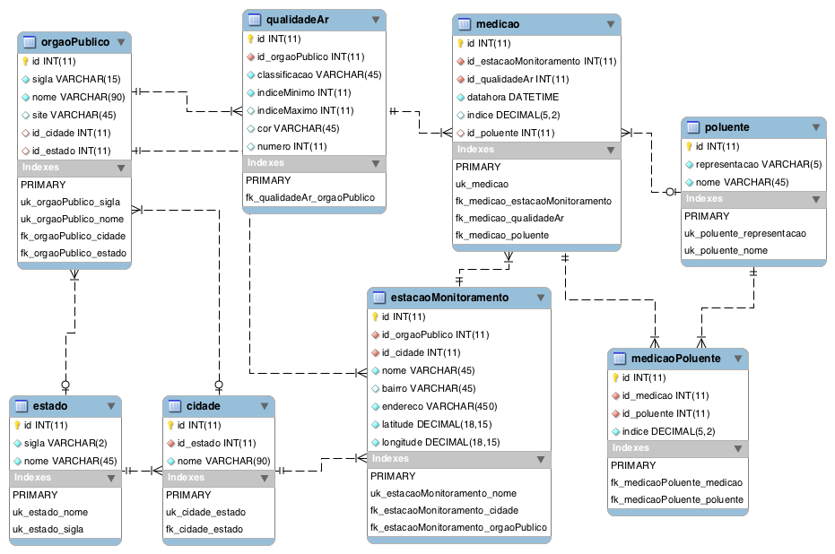

# qualidade-ar-brasil

  

Dados de qualidade do ar coletados durante o período de existência do aplicativo Post Fumaça Preta. Os dados foram publicados por diversos órgãos estaduais/municipais de meio ambiente nos seus sites. Os dados são resultado do monitoramento que estes órgãos realizam através da sua rede de estações.

## Modelo da base de dados

## Para visualizar os dados

Primeiramente, instale o [Docker](https://docs.docker.com/install) e o [Docker Compose](https://docs.docker.com/compose/install).

Depois, execute `docker-compose up -d`

Espere até [todos os dados](qualidade-ar.sql) serem carregados e no browser acesse <http://localhost:8090>.

Faça o login com o usuário **qauser** e a senha **qapass**. A base de dados é **qualidade-ar**.

### API

Os dados também podem ser obtidos via API.

Para consultar como podem ser obtidos, use como referência a documentação disponível em <http://localhost:8080/swagger-ui.html>.
